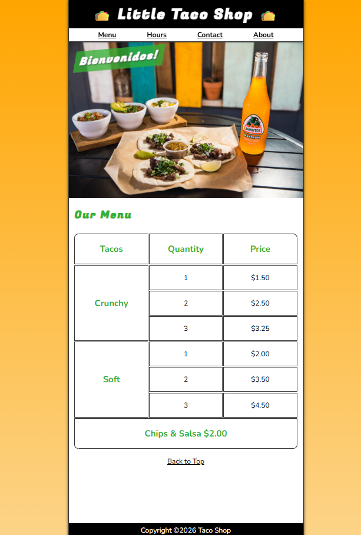
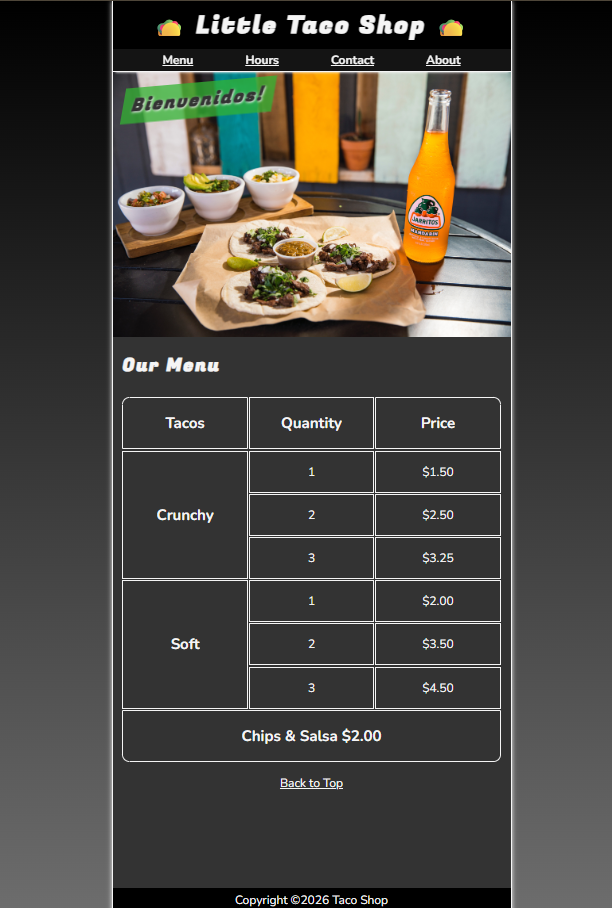
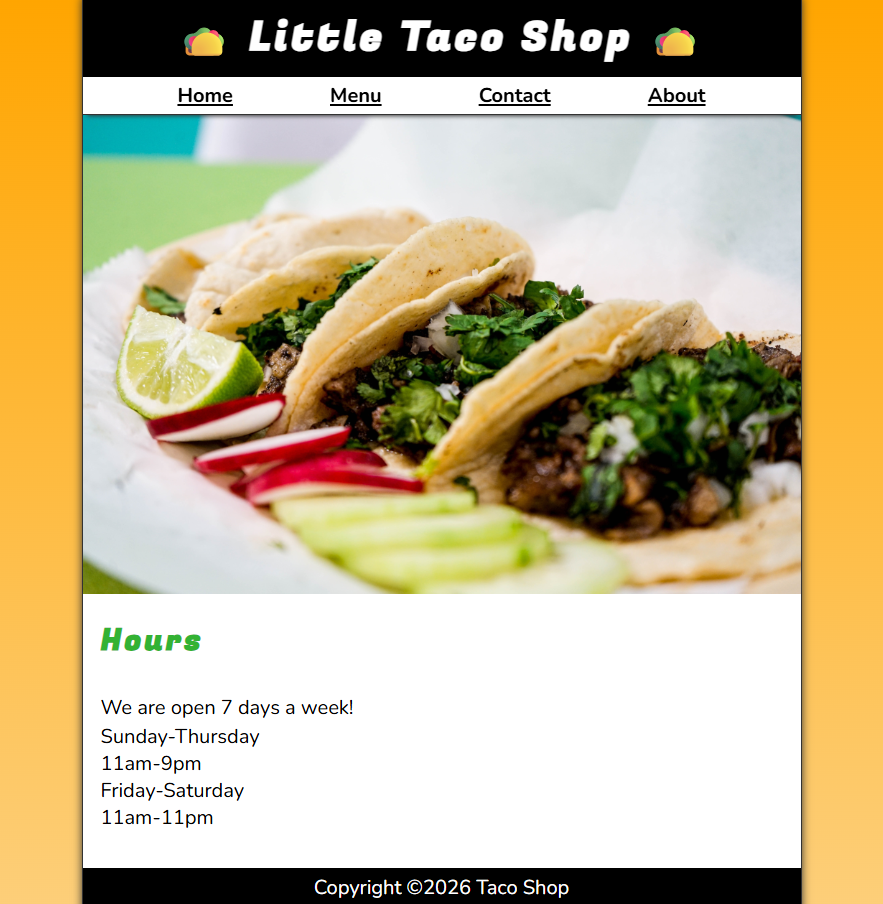
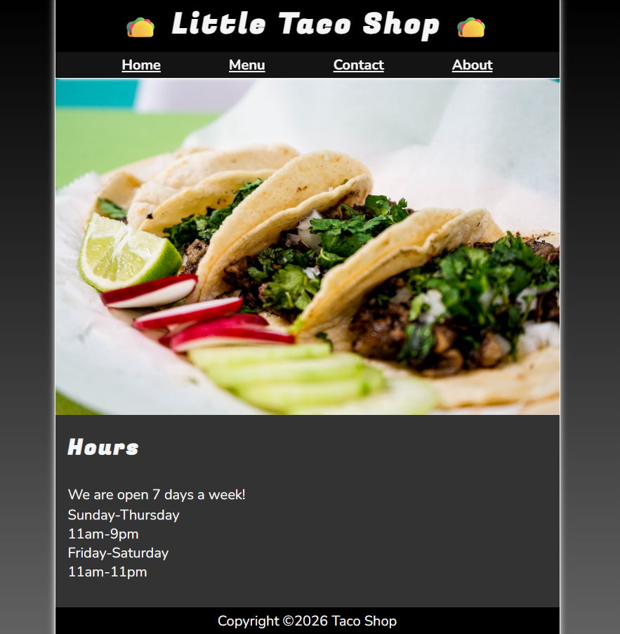
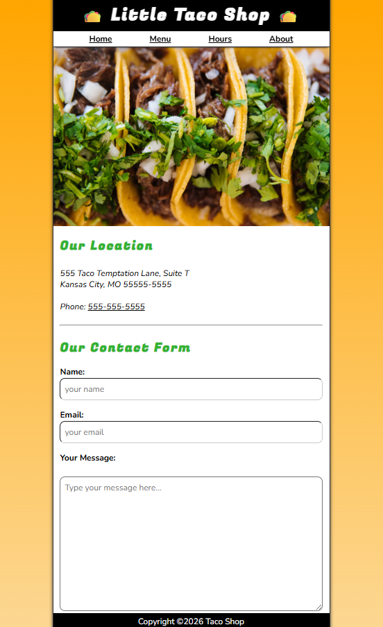
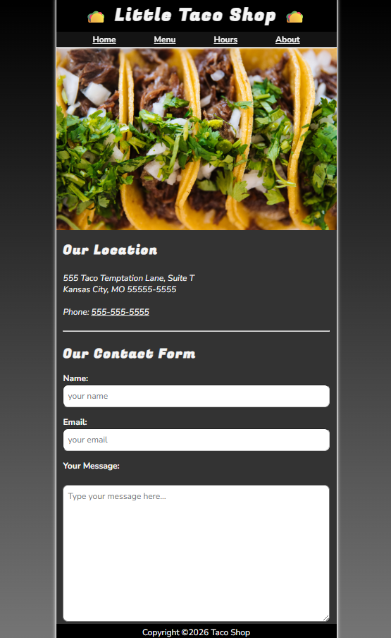
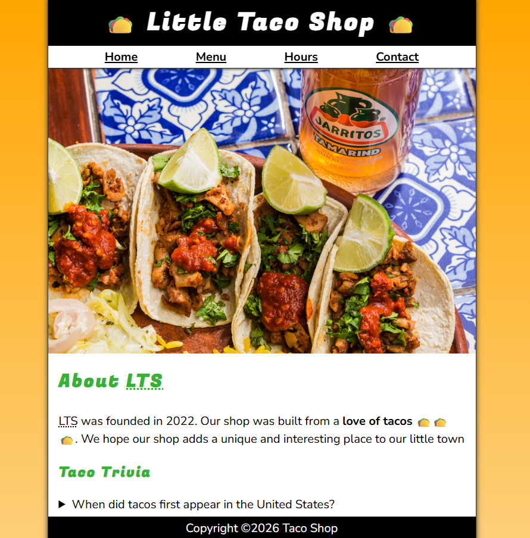
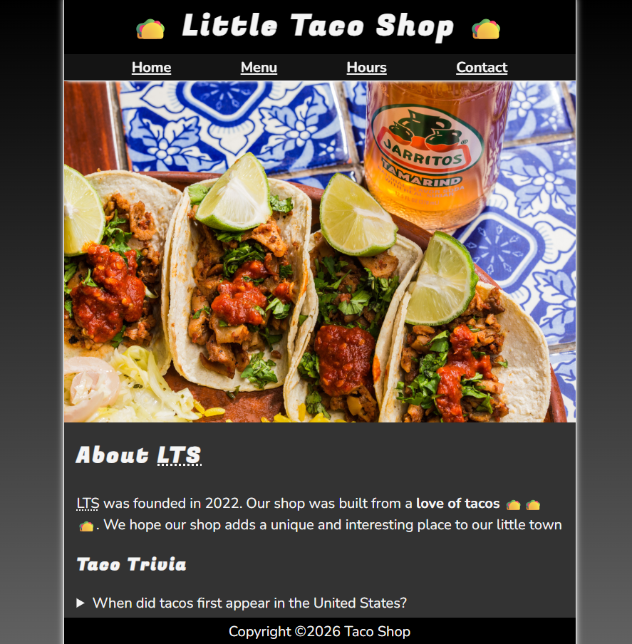

# Little Taco Shop

A responsive HTML and CSS project created while learning web development through [freeCodeCamp](https://www.freecodecamp.org/learn) and Dave Gray's course.

## Technologies

- HTML5
- CSS3

## Features

- Responsive design
- CSS Grid and Flexbox
- CSS variables
- Dark mode support
- Animations
- Accessible navigation
- Contact form

## Screenshots

Index Light

Index Dark

Hours Light

Hours Dark

Contact Light

Contact Dark

About Light

About Dark

