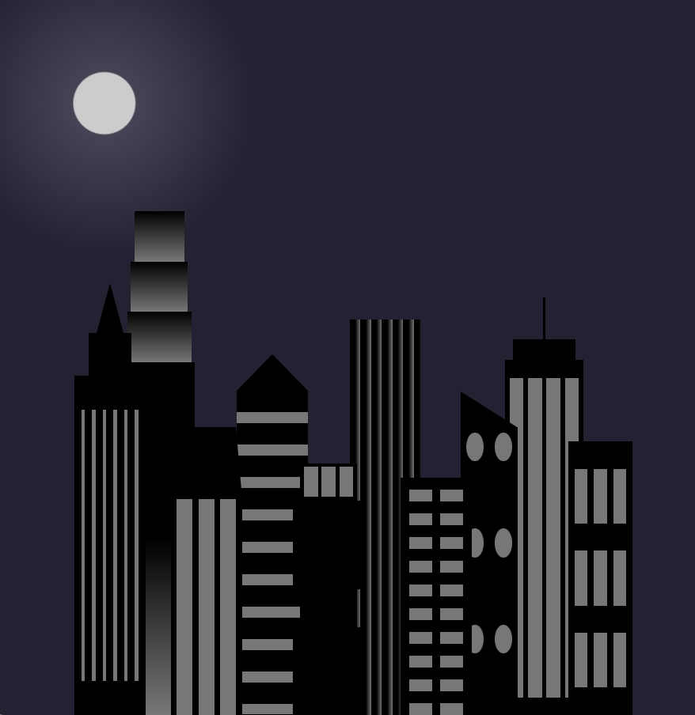

# City Skyline

A simple HTML and CSS project created while learning responsive web design through freeCodeCamp.

## Technologies

- HTML5
- CSS3

## Features

- CSS variables

- Flexbox layout

- Gradients

- Responsive design

- CSS media queries

## Screenshots

Light

Dark

