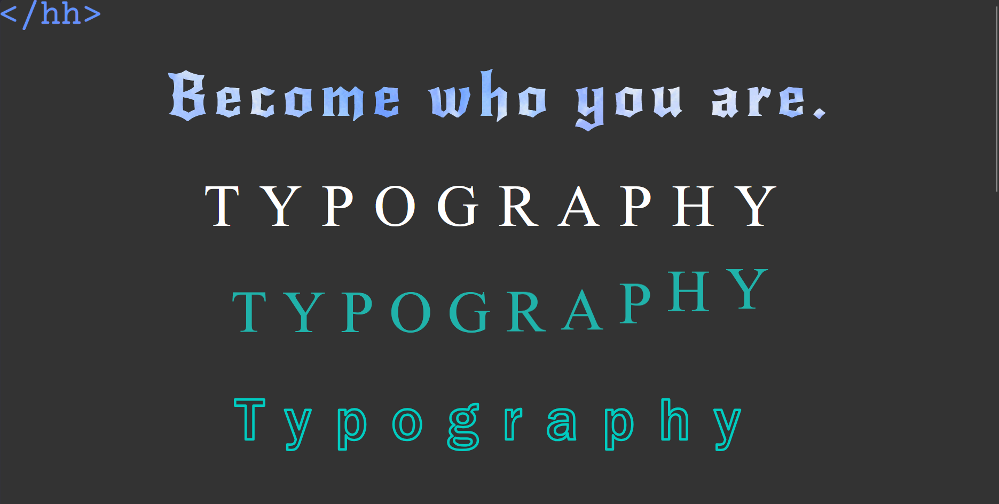
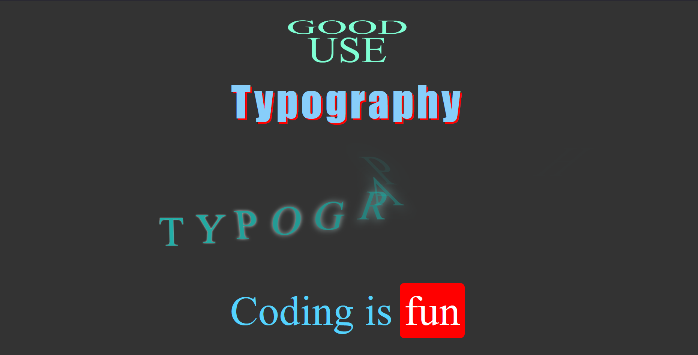

# Typography

Text styles

## Technologies

- HTML
- CSS

## Features

- Responsive design
- Background-clip
- Animations
- Transitions
- Pseudo elements
- CSS variables

## Screenshots

Index One

Index Two

